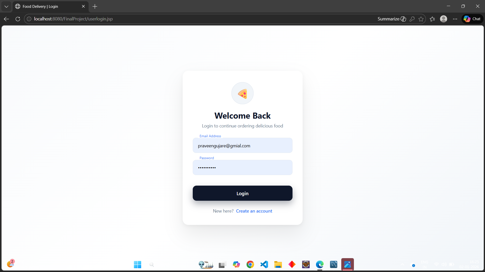
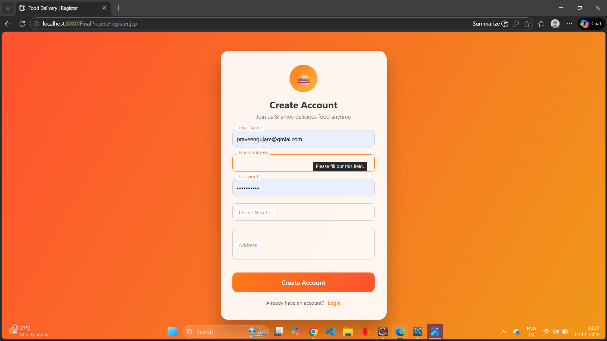
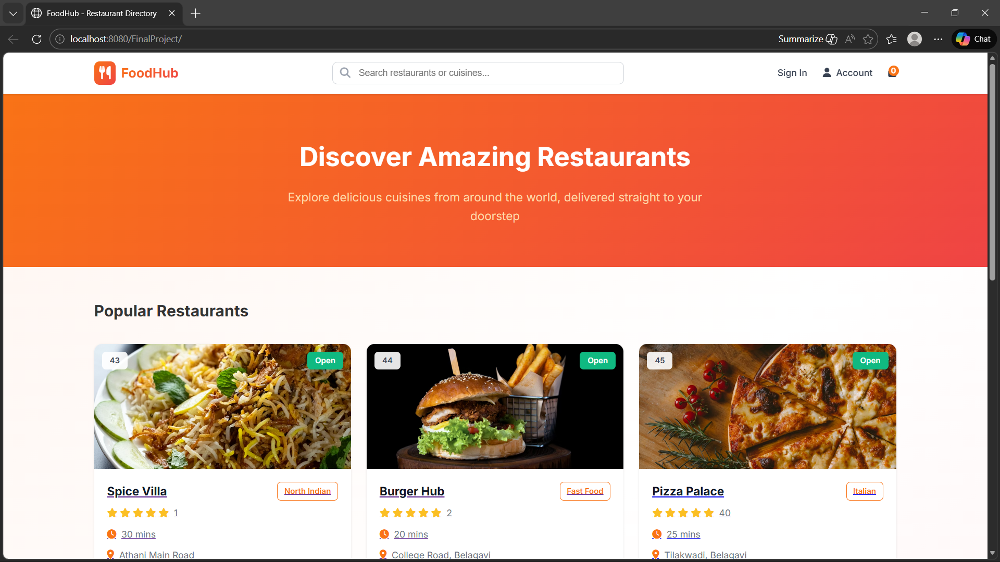
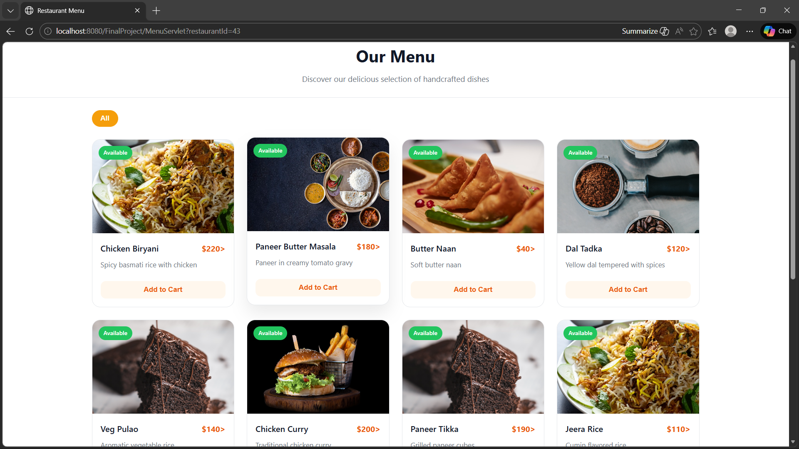
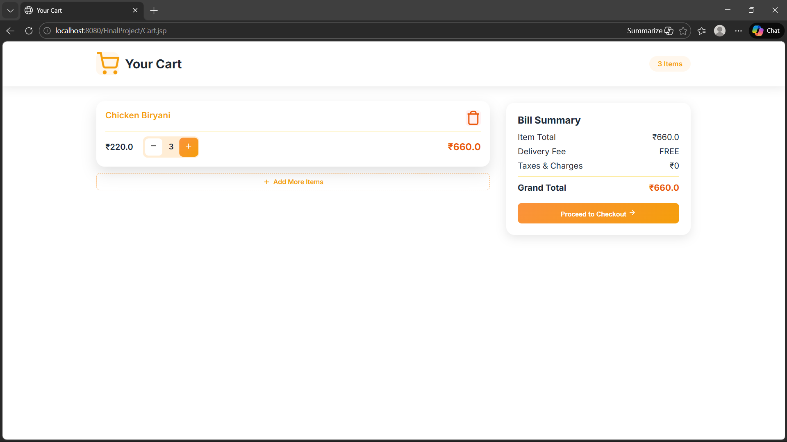
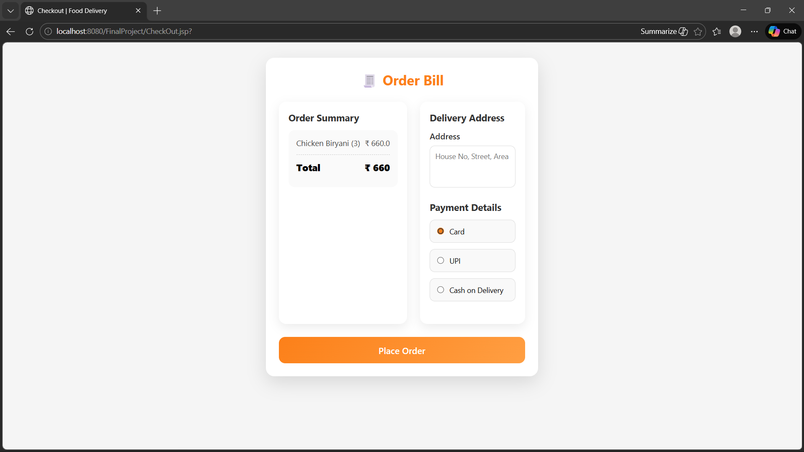

# 🍔 Food Delivery Web Application

A full-stack **Food Delivery Web Application** that allows users to browse restaurants, explore menus, add items to a cart, and place orders seamlessly.  
This project focuses on clean UI, smooth user experience, and strong backend logic using Java-based technologies.

---

## 🚀 Features

### 👤 User Features
- User Registration & Login (Session-based authentication)
- Browse restaurants and their menus
- Add food items to cart
- Update item quantity or remove items
- View cart summary
- Checkout and place orders
- Automatic order total calculation

### 🛠️ System Features
- Cart restricted to one restaurant at a time
- Order and Order Item management
- Secure session handling
- Database-driven architecture
- DAO design pattern implementation

---

## 🧑‍💻 Tech Stack

### Frontend
- HTML5  
- CSS3  
- JSP (Java Server Pages)

### Backend
- Java  
- Servlets  
- JDBC  
- DAO Design Pattern

### Database
- MySQL

### Server & Tools
- Apache Tomcat  
- MySQL Workbench  
- Eclipse / IntelliJ IDEA  

---

## 📸 Screenshots

### 🔐 Login Page

### 📝 Register Page

### 🍽️  Menu Page

### 🍽️ Restaurant & Menu Page

### 🛒 Cart Page

### 💳 Checkout Page

---

